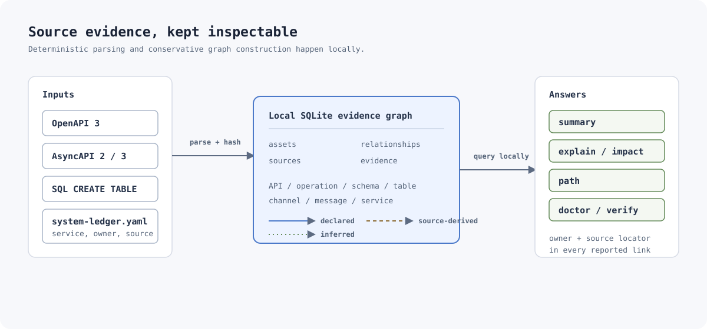
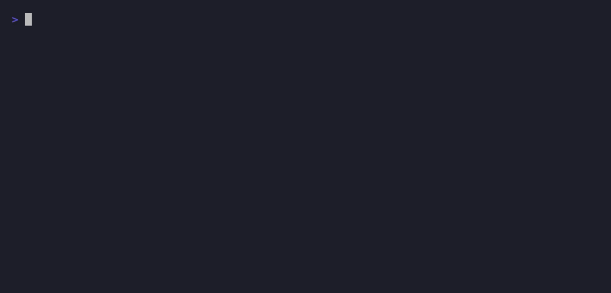

<p align="center">
  
</p>

# system-ledger

**Evidence-backed system maps and change impact analysis for engineers inheriting unfamiliar systems.**

System Ledger is a local-first Go CLI that turns declarative source evidence
into an inspectable architecture graph. It helps answer what changes for an
asset, who owns it, and which direct links could break. The local SQLite ledger
retains a source path and locator for every asset and relationship.

It makes no network calls, runs no hosted service, and has no LLM, embeddings,
or external data dependency.

## See it work

The demo scans the checked-in multi-service example, builds conservative links,
then follows an operation to its table with owner and evidence details.



[Static final frame](docs/assets/demo-preview.png) ·
[Accessible command transcript](docs/assets/demo-transcript.txt) ·
[Reproduce the recording](docs/recording.md)

## Quick start

Install the CLI:

```sh
go install github.com/Siddhant-K-code/system-ledger/cmd/system-ledger@latest
system-ledger --version
```

Or build a reproducible local binary from a clone:

```sh
go build -o bin/system-ledger ./cmd/system-ledger
./bin/system-ledger --version
```

Run the included example in a disposable copy. Its manifest defines two service
owners, OpenAPI documents, and SQL tables:

```sh
project="$(mktemp -d)"
cp -R examples/multi-service/. "$project/"

system-ledger scan --project "$project"
system-ledger build --project "$project"
system-ledger summary --project "$project"
system-ledger path --project "$project" listProducts product
system-ledger doctor --project "$project"
system-ledger verify --project "$project"

rm -rf "$project"
```

For a new project, initialize before adding sources:

```sh
system-ledger init --project /path/to/system
```

`init` creates a non-destructive `system-ledger.yaml` and the local ledger path
`<project>/.system-ledger/ledger.db`. Add one project-relative source root per
service:

```yaml
version: 1
services:
  - name: catalog-service
    owner: commerce-platform
    source: services/catalog
    domain: commerce
    tags: [api, catalog]
```

## What the CLI reports

| Task | Command | Result |
| --- | --- | --- |
| Discover evidence | `scan` | Deterministically finds supported source files and maps them to configured services. |
| Construct safe links | `build` | Rebuilds only conservative derived links. |
| Orient yourself | `summary` | Shows services, owners, assets, relationships, timestamps, and validation warnings. |
| Inspect an asset | `explain <name>` | Shows attributes, ownership, direct links, and source locators. |
| Assess direct change impact | `impact <name>` | Shows an asset's direct incoming and outgoing links. |
| Trace a dependency | `path <from> <to>` | Finds the deterministic shortest directed path, with relationship origin and evidence. |
| Diagnose project health | `doctor` | Checks manifest, roots, source drift, and whether a build is current. |
| Gate automation | `verify` | Enforces ledger, service-root, and evidence integrity. |

All commands accept `--project <directory>` and `--db <path>` when an explicit
database location is needed. `init`, `explain`, `impact`, `path`, `summary`,
`doctor`, and `verify` accept `--format text|json`; JSON is raw, stable, and
machine-readable. Text respects `NO_COLOR` and `--color auto|always|never`.

Example path output:

```text
$ system-ledger path listProducts product
Path: operation "listProducts" -> table "product"
1. outgoing references_schema [declared] schema "Product" (owner: catalog-service)
   services/catalog/openapi.yaml @ paths./products.get
2. outgoing matches_table_name [inferred] table "product" (owner: catalog-service)
   services/catalog/openapi.yaml @ normalized-name:product
   services/catalog/schema.sql @ normalized-name:product
```

## Evidence rules and supported input

| Source | Extracted facts | Relationship origin |
| --- | --- | --- |
| OpenAPI 3 JSON/YAML | APIs, operations, component schemas, local schema references | `declared` |
| AsyncAPI 2.x/3.x JSON/YAML | Documents, channels, inline publish/subscribe messages, component schemas, local payload references | `declared` |
| SQL `.sql` | Conventional `CREATE TABLE` identifiers | Assets only |
| `system-ledger.yaml` | Service name, owner, source root, optional domain and tags | `source-derived` |
| `build` | Exact normalized schema/table name matches | `inferred` |

The renderer never treats an inferred link as declared. It does not make fuzzy
matches, singularization guesses, semantic guesses, or producer/consumer
claims from prose. Every reported relationship includes the source evidence
that caused it.

`scan` limits traversal to the project root and ignores `.git`,
`.system-ledger`, `node_modules`, and `vendor`. Service roots must remain
inside the project. SQL support intentionally excludes columns, constraints,
views, procedures, dynamic SQL, and vendor-specific extensions. AsyncAPI
support intentionally covers local component schema references and inline
channel messages only.

## Operations and verification

Run `scan` after source or manifest changes, then `build`. `doctor` exits zero
for a healthy project and advisory warnings such as an unbuilt recent scan. It
exits nonzero for broken configuration, missing service roots, source drift, or
ledger failures. `verify` is the strict CI gate and exits nonzero for every
validation issue.

```sh
system-ledger doctor --project . --format json
system-ledger verify --project . --format json
```

## Develop

```sh
go test ./...
go vet ./...
go build ./cmd/system-ledger
```

Contributions should preserve deterministic ordering, local provenance, and
explicit inference rules. Please include a focused fixture or test when
extending an extractor or graph rule.

## License

[MIT](LICENSE).
